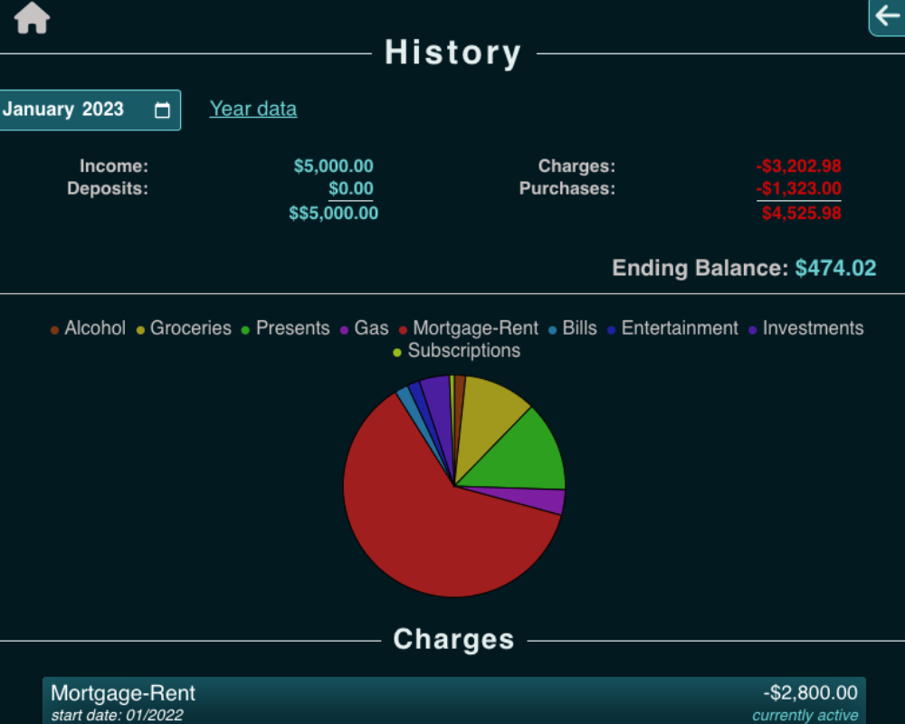

# Lunaris

**Lunaris** is a full-stack expense tracker designed for mobile devices, offering a seamless and intuitive way to manage your finances. With features like income tracking, customizable categories, recurring charges, and detailed expense analysis, Lunaris empowers users to stay on top of their financial health.

## Features

- **Expense Tracking**: Easily log expenses and categorize them for better organization.
- **Income Management**: Track monthly income and calculate net profit.
- **Recurring Charges**: Set up recurring expenses or deposits for accurate financial planning.
- **Customizable Categories**: Personalize categories to suit your unique financial needs.
- **Data Visualization**: View your financial health with intuitive charts powered by Pycharts.js.
- **Secure Authentication**: Bcrypt-secured user accounts to keep your data safe.
- **Transaction History**: Review past months and get a snapshot of your yearly financial trends.
- **PWA Support**: Optimized for mobile devices with offline capabilities.
- **Spending Analysis**: Identify trends to help you limit unnecessary expenses.

## Technologies Used

- **Frontend**: JavaScript, Sass, Jinja2
- **Backend**: Python, Flask, SQLAlchemy
- **Database**: PostgreSQL
- **Authentication**: Bcrypt for secure password hashing
- **Charts**: Pycharts.js for data visualization
